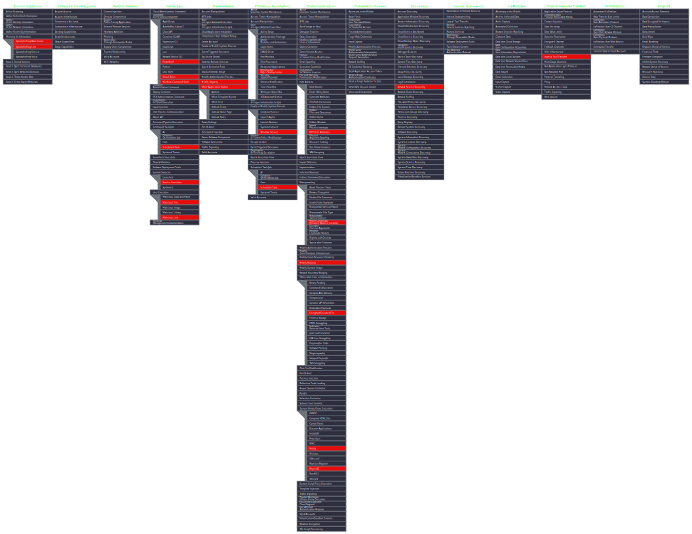

# MITRE ATT&CK Mapping Exercise > Operation Cobalt Kitty

## Overview

This repository documents a hands-on exercise in threat intelligence analysis using the [MITRE ATT&CK Framework](https://attack.mitre.org/) and the [ATT&CK Navigator](https://mitre-attack.github.io/attack-navigator/).

The goal was to read a real-world threat intelligence report, identify the adversary techniques described in the narrative, and map them to their corresponding ATT&CK techniques, then export the result as a Navigator layer.

**Source report:** *Operation Cobalt Kitty > Attackers' Arsenal* by Assaf Dahan, Cybereason (2017)  
**Threat actor:** OceanLotus Group (APT32)  
**ATT&CK version used:** v18

---

## What I Did

1. Read the Cybereason Cobalt Kitty threat report, which documents a targeted APT attack against a multinational corporation
2. Identified each attacker behavior described in the report and matched it to the correct ATT&CK technique or sub-technique
3. Loaded those techniques into the ATT&CK Navigator and marked them (highlighted in red)
4. Exported the final layer as both `.json` and `.svg`

---

## Attack Summary

Operation Cobalt Kitty was a long-running cyber-espionage campaign attributed to the OceanLotus Group. The attack followed a classic APT kill chain:

| Phase | Description |
|---|---|
| **Initial Access** | Spear-phishing emails with malicious links and Word documents containing macros |
| **Execution** | Multi-stage fileless payload delivery via VBScript, PowerShell, and scheduled tasks |
| **Persistence** | Windows Registry autoruns, Windows Services, Scheduled Tasks, Outlook macro backdoor |
| **Defense Evasion** | NTFS Alternate Data Streams, obfuscated scripts, masquerading, Regsvr32/Mshta LOLBins |
| **C2 Communication** | HTTP-based Cobalt Strike Beacon, COM scriptlets via Regsvr32 |
| **Discovery** | Internal network scanning for open ports, services, and vulnerabilities |
| **Lateral Movement** | Pass-the-hash, Pass-the-ticket, Mimikatz credential dumping |

---

## Mapped ATT&CK Techniques

The following techniques were identified and mapped. Techniques marked with a sub-technique (`.xxx`) were confirmed with specific evidence in the report.

### Reconnaissance
| Technique ID | Name | Evidence |
|---|---|---|
| T1598.002 | Spearphishing Link | Emails linking to fake Flash installer download |
| T1598.003 | Spearphishing Attachment | Word documents (CV.doc, Complaint_Letter.doc) with macros |

### Execution
| Technique ID | Name | Evidence |
|---|---|---|
| T1059.001 | PowerShell | Obfuscated PowerShell payloads delivering Cobalt Strike Beacon |
| T1059.003 | Windows Command Shell | cmd.exe used to pass XOR'd payloads |
| T1059.005 | Visual Basic | VBScript in .txt files executing PowerShell via WMI |
| T1053.005 | Scheduled Task | Two scheduled tasks created by malicious macro |
| T1204.001 | Malicious Link | Victim clicks link to fake Flash installer |
| T1204.002 | Malicious File | Victim opens malicious Word document |
| T1569.002 | Service Execution | Windows Services used to execute PowerShell scripts |
| T1218.005 | Mshta | `mshta.exe` used to execute remote VBScript payload |

### Persistence
| Technique ID | Name | Evidence |
|---|---|---|
| T1053.005 | Scheduled Task | Recurring tasks for payload download/execution |
| T1543.003 | Windows Service | Services created/modified for persistent beacon loading |
| T1547.001 | Registry Run Keys | Autorun keys under HKCU and HKLM pointing to VBS/PS scripts |
| T1137 | Office Application Startup | Malicious Outlook macro (vbaproject.otm) |
| T1112 | Modify Registry | Registry edit to force Outlook macro load on boot |

### Privilege Escalation
| Technique ID | Name | Evidence |
|---|---|---|
| T1053.005 | Scheduled Task | Scheduled tasks run with elevated privileges |
| T1543.003 | Windows Service | Service creation for privilege persistence |
| T1547.001 | Registry Run Keys | Autorun keys executed at system level |

### Defense Evasion
| Technique ID | Name | Evidence |
|---|---|---|
| T1027.013 | Encrypted/Encoded File | XOR-encrypted and base64-encoded payloads |
| T1036.005 | Match Legitimate Name | Netcat renamed to `kb-10233.exe` (fake Windows update) |
| T1112 | Modify Registry | Registry modifications for stealthy persistence |
| T1218.005 | Mshta | LOLBin abuse to execute remote scripts |
| T1218.010 | Regsvr32 | COM scriptlets downloaded and executed via `regsvr32.exe` |
| T1564.004 | NTFS File Attributes | NTFS Alternate Data Streams used to hide payloads |

### Discovery
| Technique ID | Name | Evidence |
|---|---|---|
| T1046 | Network Service Discovery | Port scanning across internal IP ranges |

### Command and Control
| Technique ID | Name | Evidence |
|---|---|---|
| T1105 | Ingress Tool Transfer | Download of payloads disguised as `.jpg` files from C2 |

---

## Navigator Layer



---

## Files

```
.
├── README.md                                  # This file
├── layer.json                                 # ATT&CK Navigator layer (importable)
├── layer.svg                                  # Visual export of the Navigator layer
└── Cybereason_Cobalt_Kitty_tactic_hints.pdf  # Source report (Cybereason, 2017)
```

---

## Key Takeaways

- **LOLBins (Living-off-the-Land Binaries)** were central to this campaign. Using legitimate Windows tools like `mshta.exe` and `regsvr32.exe` makes detection harder since no custom malware hits the disk.
- **Fileless execution** was a deliberate strategy >> most payloads were downloaded into memory and never written to disk, severely limiting forensic artifacts.
- **Layered persistence** across Registry, Services, Scheduled Tasks, and Outlook macros made the attacker resilient to partial remediation.
- Reading a report carefully for *behavioral evidence* (not just tool names) is essential to accurate ATT&CK mapping.

---

## References

- [Cybereason > Operation Cobalt Kitty Full Report](https://cdn2.hubspot.net/hubfs/3354902/Cybereason%20Labs%20Analysis%20Operation%20Cobalt%20Kitty.pdf)
- [MITRE ATT&CK Enterprise Matrix](https://attack.mitre.org/matrices/enterprise/)
- [ATT&CK Navigator](https://mitre-attack.github.io/attack-navigator/)
